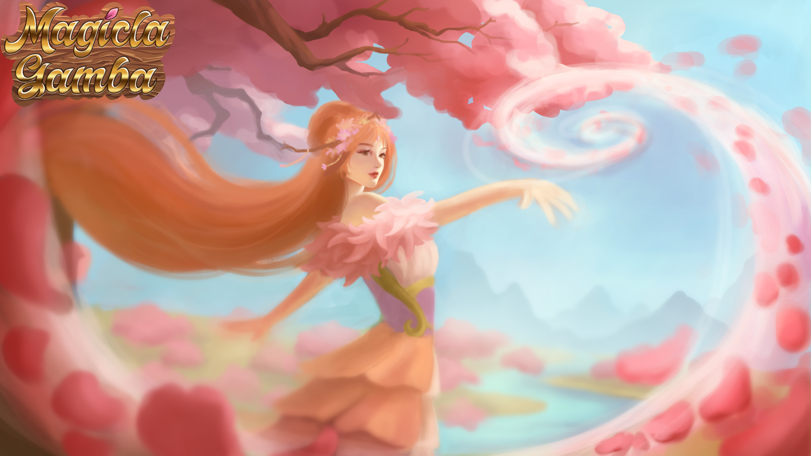

# About Magicla Gamba  
Magicla Gamba is a PvP Card Battler, with a unique Resource Mechanic. It forces the Player to constantly adapt their strategy, while directly interacting with the opponent for resources through a Draft System. All that while exploring the myths of the Forest and its beautiful art.

## Engine/Languages:  
Godot 4.3 with mainly C# and a little of GDScript 

## Roles:  
Backend, Frontend and Gameplay Programmer

## Notable Tasks:  
[Backend Creation](scripts/Models/GameModel.cs)  
[Message System](scripts/Network/MessageType.cs)  

  

## The Team: 
Marcel Timmler - Production, Balancing - https://www.linkedin.com/in/marcel-timmler-46b7a7309/  
Jiajun Zhou -  Game Design - www.jiajunzgd.com  
Henrik Pape - Programming - Me - https://www.linkedin.com/in/henrik-pape-b87a811b8  
Julia Rydzewska - Card Art, VFX  
Natalia Rydzewska - Card Art  
Shirin Nitschke - Card Art, Board Art - https://www.artstation.com/sqir  
Tanya Spitzer - UI Art - https://www.linkedin.com/in/tanya-spitzer-15730a2a4/ - https://www.artstation.com/roda_ye  
Tommy Boerner - Card Art  
